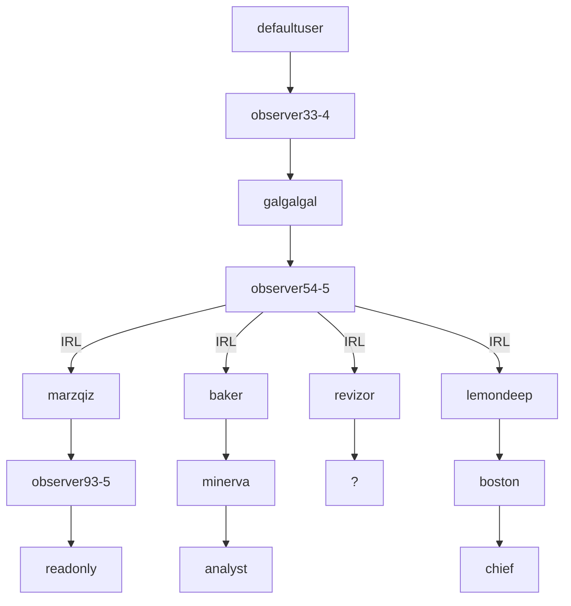

## ARRS Season 3 
# DONT USE CHAT-GPT UNDER ANY CIRCUMSTANCE!!!
State: 07/24/2023 4:48pm UTC+3

| User         | Password                          | Level    | Status     | Name          | Solved-Status (Presumed) |
|--------------|-----------------------------------|----------|------------|---------------|--------------------------|
| defaultuser  | 123456test                        | observer | Active     | System user   | Solved                   | 
| observer33-4 | 098712345                         | observer | Not Active | James Torwind | Solved                   |   
| galgalgal    | 6.62607015\*10^−34J\*Hz^−1        | observer | Active     | Max Planck    | Solved                   |  
| observer54-5 | rtuihfij34fi23poetgy3wed23sdc2125 | observer | Not Active | Deleted       | Solved                   |
| revizor      | greenJNefimpo234                  | observer | Active     | confidential  | WIP                      |
| marzqiz      | redKL3245pfvkl3j4                 | observer | Active     | System user   | Solved                   |
| baker        | blueJuih4ol23ik1                  | observer | Active     | Mike          | Solved                   | 
| lemondeep    | yellowL23k4jn6ddjx                | observer | Active     | confidential  | Solved                   |
| observer93-5 | Jje=2ksxkk2p;1                    | observer | Active     | Homer Smith   | WIP                      |
| minerva      | 8vwz/tW//vc=                      | analyst  | Active     | Minnie        | Solved                   |
| analyst      | athenarole                        | analyst  | not Active | Jack          | WIP                      |
| boston       | lucky1marksman                    | observer | Active     | confidential  | WIP                      |
| chief        | cheerful2rifleman                 | observer | Active     | confidential  | WIP                      |
| ?            | pw2:llpymhbec                     | ?        | ?          | ?             | Not Unlocked             |
| readonly     |                                   | ?        | ?          | ?             | Not Unlocked             |
| overseer545  | 8719a72bef8885db906d376cd6713479  | overseer | Active     | Hash          | WIP                      |

# For newest info check users/
---
# Pword currently not used 
pw2: llpymhbec <-- from chief - diary5 and 8 

# Needs decoding / unused
login: readonly <-- from observer93-5 - Seven.zip using base64 and Affine (A7B4) 
seeker <-- appeared in revizor - user 
ln;3jn3rfg <-- observer93-5 - copy_message_65 
The Supreme Admin 

# Decoders / Ciphers used  
1. https://gchq.github.io/CyberChef/
2. https://www.dcode.fr/cipher-identifier
3. https://www.boxentriq.com/
4. https://cryptii.com  
Affine - Vignere cipher  
Playfair  
base64  
Rot23 

# Sonnet Progress  
1. verse --> trash_can_foto.jpg
2. verse --> alpha_case.png
3. verse --> see_it.png
4. verse --> battle.png
5. verse --> ??? probaply in lemondeep
6. verse --> Minerva.jpg
7. verse --> Avatar.jpg  (we are probably here)
8. verse --> ...
9. verse --> ...
10. verse --> ...
11. verse --> ...
12. verse --> ...
13. verse --> ...
14. verse --> ...
---
    Being your slave, what should I do but tend
    Upon the hours and times of your desire?
    I have no precious time at all to spend,
    Nor services to do, till you require.
    Nor dare I chide the world-without-end hour
    Whilst I, my sovereign, watch the clock for you.
    Nor think the bitterness of absence sour
    When you have bid your servant once adieu;
    Nor dare I question with my jealous thought
    Where you may be, or your affairs suppose,
    But like a sad slave, stay and think of nought,
    Save, where you are how happy you make those.
    So true a fool is love that in your will
    Though you do anything, he thinks no ill.
