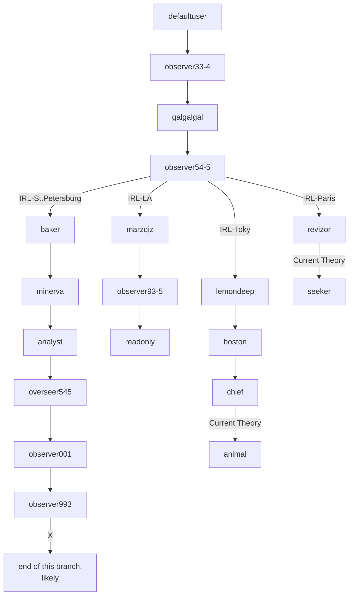

## ARRS Season 3 
# DONT USE CHAT-GPT UNDER ANY CIRCUMSTANCE !!!
# DONT GO INGAME !!!
State: 07/24/2023 8:36pm UTC+3

| User                                               | Password                          | Level    | Status     | Name          | Solved-Status (Presumed) |
|----------------------------------------------------|-----------------------------------|----------|------------|---------------|--------------------------|
| [defaultuser](./Users/Pre_IRL/defaultuser.md)      | 123456test                        | observer | Active     | System user   | Solved                   | 
| [observer33-4](./Users/Pre_IRL/observer33-4.md)    | 098712345                         | observer | Not Active | James Torwind | Solved                   |   
| [galgalgal](./Users/Pre_IRL/galgalgal.md)          | 6.62607015\*10^−34J\*Hz^−1        | observer | Active     | Max Planck    | Solved                   |  
| [observer54-5](./Users/Pre_IRL/observer54-5.md)    | rtuihfij34fi23poetgy3wed23sdc2125 | observer | Not Active | Deleted       | Solved                   |
| [revizor](./Users/France/revizor.md)               | greenJNefimpo234                  | observer | Active     | confidential  | WIP                      |
| [marzqiz](./Users/USA/marzqiz.md)                  | redKL3245pfvkl3j4                 | observer | Active     | System user   | Solved                   |
| [baker](./Users/Russia/baker.md)                   | blueJuih4ol23ik1                  | observer | Active     | Mike          | Solved                   | 
| [lemondeep](./Users/Japan/lemondeep.md)            | yellowL23k4jn6ddjx                | observer | Active     | confidential  | Solved                   |
| [observer93-5](./Users/USA/observer93-5.md)        | Jje=2ksxkk2p;1                    | observer | Active     | Homer Smith   | WIP                      |
| [minerva](./Users/Russia/minerva.md)               | 8vwz/tW//vc=                      | analyst  | Active     | Minnie        | Solved                   |
| [analyst](./Users/Russia/analyst.md)               | athenarole                        | analyst  | not Active | Jack          | Solved                   |
| [boston](./Users/Japan/boston.md)                  | lucky1marksman                    | observer | Active     | confidential  | Solved                   |
| [chief](./Users/Japan/chief.md)                    | cheerful2rifleman                 | observer | Active     | confidential  | WIP                      |
| [overseer545](./Users/Russia/overseer545.md)       | 8719a72bef8885db906d376cd6713479  | overseer | Active     | Hash          | Solved                   |
| [observer001](./Users/Russia/observer001.md)       | 12c19389f01ca269                  | observer | Active     | unknown       | Solved                   |
| [observer993](./Users/Russia/observer993.md)       | 333winner3                        | observer | Active     | unknown       | Finished                 |
| [readonly](./Users/USA/readonly.md)                | ME3krfm234icmMI5O3xsd             | observer | Active     | DELETED       | WIP                      |

# For newest info check users/
---
# Pword currently not used 
### Japan
* pw2: llpymhbec <-- from chief - diary5 and 8 

# Needs decoding / unused
* The Supreme Admin 
### USA
* ln;3jn3rfg <-- observer93-5 - copy_message_65 
### France
* seeker <-- appeared in revizor - user 
### Japan  
* animal <-- appeared in chief 

# Decoders / Ciphers used  
1. https://gchq.github.io/CyberChef/ 
2. https://www.dcode.fr/cipher-identifier 
3. https://www.boxentriq.com/ 
4. https://cryptii.com   
5. https://sladex.org/blowfish.js/ 
Affine 
Vignere cipher   
Playfair   
base64   
Rot\* 
railfence   
blowfish   

# Sonnet Progress  
1. verse --> trash_can_foto.jpg
2. verse --> alpha_case.png
3. verse --> see_it.png
4. verse --> battle.png
5. verse --> ??? probaply in lemondeep
6. verse --> Minerva.jpg
7. verse --> Avatar.jpg  (we are probably here)
8. verse --> ...
9. verse --> ...
10. verse --> ...
11. verse --> ...
12. verse --> ...
13. verse --> ...
14. verse --> ...
---
    Being your slave, what should I do but tend
    Upon the hours and times of your desire?
    I have no precious time at all to spend,
    Nor services to do, till you require.
    Nor dare I chide the world-without-end hour
    Whilst I, my sovereign, watch the clock for you.
    Nor think the bitterness of absence sour
    When you have bid your servant once adieu;
    Nor dare I question with my jealous thought
    Where you may be, or your affairs suppose,
    But like a sad slave, stay and think of nought,
    Save, where you are how happy you make those.
    So true a fool is love that in your will
    Though you do anything, he thinks no ill.

# Github credit:
* [3ncy](https://github.com/3ncy) - Discord:3ncy 
* [Niklas R](https://github.com/NiklasRosenkranz) - Discord:petermaffay 
